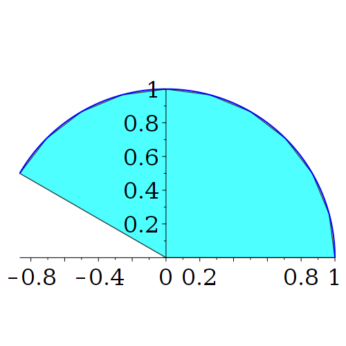

Claro! Abaixo está o **documento em Markdown** atualizado para o caso onde a **circunferência é percorrida no sentido horário**, com base no seu novo código Maple. A imagem de referência continua sendo `01.png` — que você possui localmente.

---

## 📝 Documento: Parametrização no Sentido Horário de uma Circunferência

### 📌 Objetivo

Este experimento tem por finalidade ilustrar a **parametrização no sentido horário** de um arco de circunferência, centrado na origem e de raio $r = 1$, com um setor correspondente preenchido em azul claro. O gráfico gerado está ilustrado abaixo:



---

### 🧭 Parametrização horária da circunferência

A circunferência de raio $r$, centrada na origem, pode ser descrita no **sentido horário** pela seguinte parametrização:

$$
\vec{\gamma}(t) = (r \cos t,\ -r \sin t), \quad t \in [0, 2\pi]
$$

Note que essa fórmula é obtida a partir da parametrização anti-horária usual $(r\cos t,\ r\sin t)$ trocando o **sinal do seno**, o que inverte o sentido de percurso.

---

### 🧪 Código Maple usado

```maple
restart:
with(plots):

# Raio da circunferência
r := 1:

# Parametrização da circunferência no sentido horário
x := t -> r*cos(t):
y := t -> -r*sin(t):

# Intervalo do parâmetro t
tmin := 0:
tmax := evalf((5*Pi)/6):
N    := 10:
step := evalf((tmax - tmin)/N):

# Curva azul representando o arco da circunferência
circ := plot([x(t), y(t), t = tmin .. tmax], color = blue, thickness = 2):

# Preenchimento do setor circular com um polígono
preenchimento := plottools[polygon](
   [[0, 0], seq([x(t), y(t)], t = tmin .. tmax, step)], color = cyan, transparency = 0.3
);

# Combinar curva e preenchimento
display([preenchimento, circ], scaling = constrained, axes = normal);
```

---

### 🔍 Análise do Código

* A curva $(x(t), y(t)) = (r\cos t,\ -r\sin t)$ gira **no sentido horário** a partir do ponto $(r, 0)$.
* A variável `step` divide o intervalo de $t \in [0, 5\pi/6]$ em 10 partes.
* A função `plottools[polygon]` é usada para criar uma "fatia" com preenchimento suave entre o centro da circunferência e os pontos do arco.

---

### 📘 Conclusão

A inversão do sinal do seno na parametrização muda o sentido de varredura da circunferência, e o resultado visual é um arco percorrido **no sentido horário**. Isso tem aplicações importantes em gráficos vetoriais, análise de orientações em física e engenharia, e em técnicas de preenchimento paramétrico.

---


